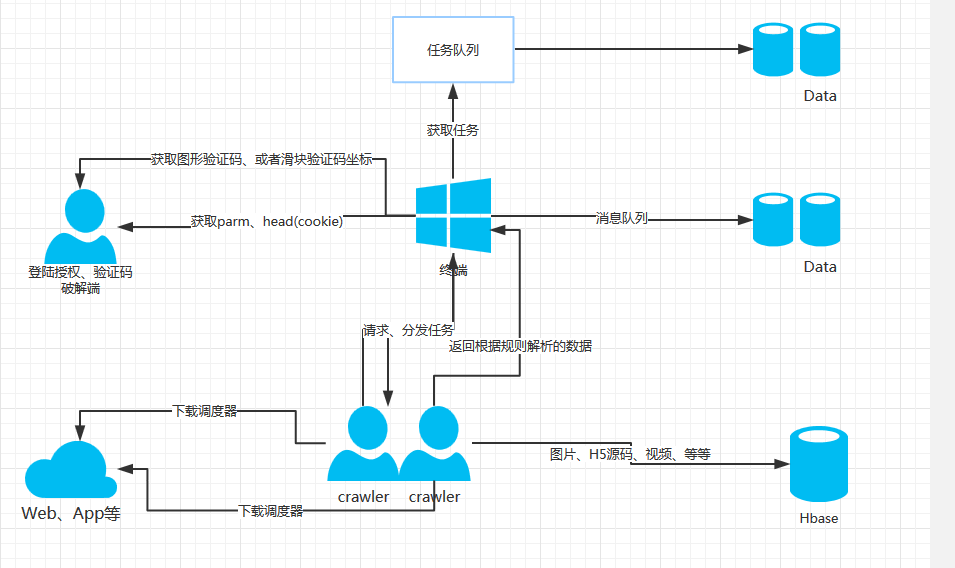

# 分布式爬虫爬虫架构



**框架内通信协议：** TCP。传输json格式的字符串，用UTF-8编码。
<br>**Master的IP、Port：** 通过BaseModule.Configloader的master_host与master_port变量获得
<br>**首次爬取URL:** https://www.taobao.com/markets/tbhome/market-list

**python目录结构**
> - Authorizes:登陆相关、验证码识别相关
> - DB:数据库处理相关
> - Master：
> - Crawler：
> - BaseModule：
> - Socket：

------

# Master Crawler交互协议
> * 字段默认都是必须传的
> * 注册后，每次request都要带上client_id
> * 利用结束符'\0'标记着传输完毕

### 1.注册，首次启动需要注册，并获取clientId
##### 请求格式:
```json
{
    'request_type' : 'register',
    'client_name'：'',
    'request_time'：    #时间戳的形式
}
```
##### 返回格式:
```json
{
    'client_id' : '',
    'server_status'：''
}
```

### 2.HEARTBEAT心跳检测（每30秒上传一次）
##### 请求格式:
```json
{
    'request_type' : 'heartbeat',
    'client_id'：'',
    'request_time'：    #时间戳的形式
}
```
##### 返回格式:
```json
{
    'server_status'：''
}
```
###### 有报错则返回
```json
{
    'error' : [错误类型]
    'server_status' :
}
```
**错误类型:**
> * err_not_found：服务器端未发现该client(需要重新注册)